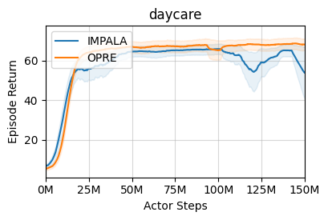
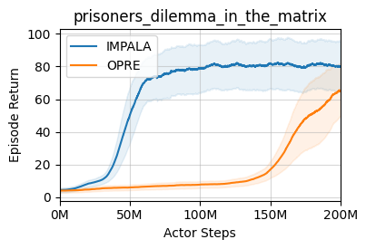

# marl-jax
JAX library for MARL research

[Demo Video](https://youtu.be/WQVQXPIUZxk)
[Paper Link](https://arxiv.org/abs/2303.13808)

## Implemented Algorithms
- [x] Independent-IMPALA for multi-agent environments
- [x] [OPRE](https://www.deepmind.com/publications/options-as-responses-grounding-behavioural-hierarchies-in-multi-agent-rl)


## Environments supported
- [x] [Meltingpot](https://github.com/deepmind/meltingpot/)
- [x] [Overcooked](https://github.com/HumanCompatibleAI/overcooked_ai)
- [x] [Sequential Social Dilemma](https://github.com/eugenevinitsky/sequential_social_dilemma_games)

## Other Features
- [x] Distributed training (IMPALA style architecture)
  - Dynamically distribute load of multiple agents across available GPUs
  - Run multiple environment instances, one per CPU core for experience collection
- [x] Wandb and Tensorboard logging
- [x] PopArt normalization

## Help
- [Installation Instructions](installation.md)
- [Environment Details](environments.md)

## Results

### Daycare

|            | IMPALA     | OPRE       |
|------------|------------|------------|
| Substrate  | 65.944444  | 67.833333  |
| Scenario 0 | 0.888889   | 0.333333   |
| Scenario 1 | 109.111111 | 126.000000 |
| Scenario 2 | 0.222222   | 0.000000   |
| Scenario 3 | 154.555556 | 171.333333 |

### Prisoner's Dilemma in the Matrix Repeated
 

|            | IMPALA     | OPRE       |
|------------|------------|------------|
| Substrate  | 106.849834 | 38.178917  |
| Scenario 0 | 131.002046 | 59.706502  |
| Scenario 1 | 176.537759 | 114.685576 |
| Scenario 2 | 79.583174  | 27.968283  |
| Scenario 3 | 62.804043  | 41.763728  |
| Scenario 4 | 48.626646  | 38.745093  |
| Scenario 5 | 65.819378  | 47.660647  |
| Scenario 6 | 101.830552 | 40.335949  |
| Scenario 7 | 83.325145  | 49.824935  |
| Scenario 8 | 77.751732  | 32.586948  |
| Scenario 9 | 78.408784  | 74.622007  |


## Implementation References
- [Deepmind's Acme](https://github.com/deepmind/acme/)

## Citation

If you use this code in your project, please cite the following paper:
```bibtex
@article{mehta2023marljax,
      title={marl-jax: Multi-agent Reinforcement Leaning framework for Social Generalization}, 
      author={Kinal Mehta and Anuj Mahajan and Pawan Kumar},
      year={2023},
      journal={arXiv preprint arXiv:2303.13808},
      url={https://arxiv.org/abs/2303.13808},
}
```
